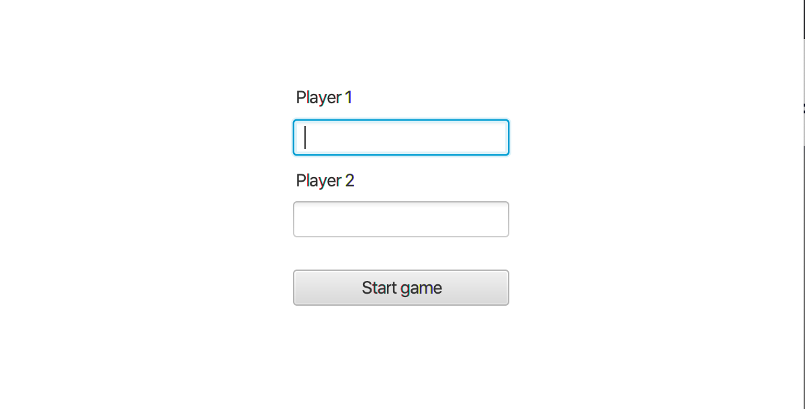
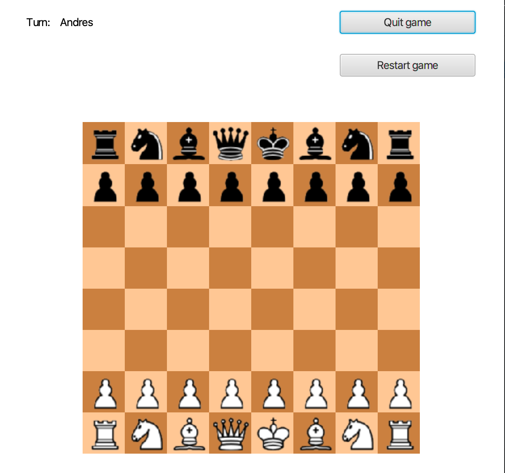
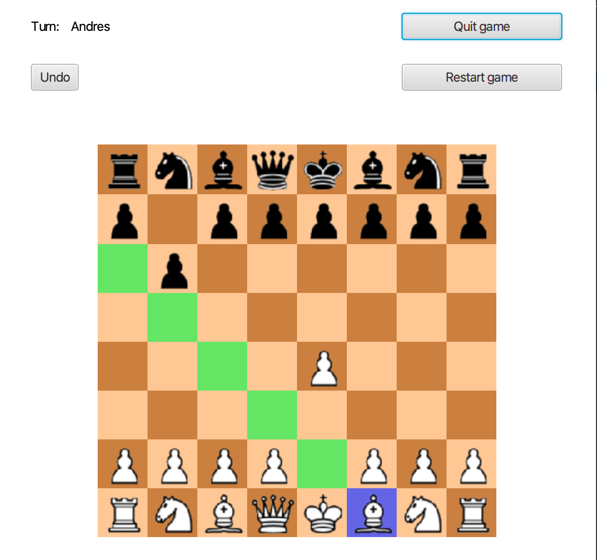
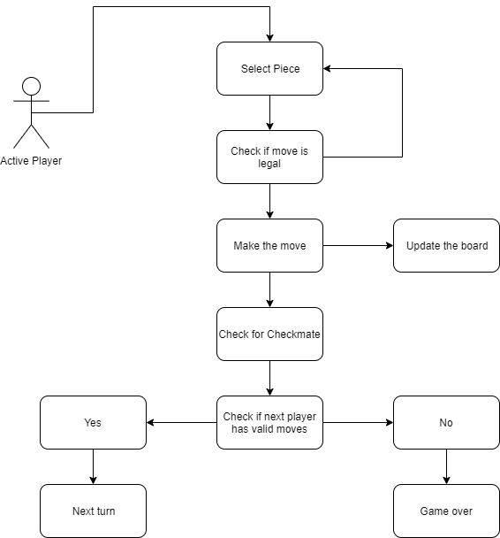

# Chess game with JavaFX 

This is a GUI based chess game that implements basic object-oriented programming concepts in Java. The program allows two players to play
 on the same machine.

## Getting Started

### Prerequisites

##### [Java](https://www.java.com/en/download/help/sysreq.xml)
Make sure you have the correct Java JRE Runtime installed for your
Operating System. If you're running Windows x64, use Java for x64 and not
the x86 version.

##### [Maven](https://maven.apache.org/)
Install Maven and check if it is correctly installed by running ```mvn -v```

### Installing

Run the following commands in the command line

##### 1. Clone repository 

```git clone https://github.com/UPenn-CIT599/final-project-team-75-chess-game```

##### 2. Test

```mvn test```

##### 3. Run

```mvn exec:java```

## How to play

### Main Screen

The main screen allows the users to choose their usernames and start the game. Usernames must be different and cannot be longer than 12 characters.



### Game Screen

The game starts with the white player on the bottom and the black player on top.

The active user is shown on the top left of the window, next to the "Turn" label. On the top right, there is a "Quit game" button that returns to the main screen, and a "Restart game" button that sets the board to its initial state.



For moving, the active player must click on any of its pieces, which will turn the background to blue, signaling that it is selected.
Once a piece is selected, every tile that the piece can move to will be painted on green. The user can click any of these and move, or
click any other tile and deselect the current piece.

After the first move, an "Undo" button will appear, which can be clicked as many times as desired to return to previous states of the game.

The game allows castling as per chess rules, and will alert the users when the king is under check. In this case, the threatened user will not be able to do any move that doesn't eliminate the threat. 



Below there is a diagram showing briefly how the game logic works.



## Authors

1. Andrés Mechali (amechali@seas.upenn.edu)
2. Viorel Rotaru (vrotaru@seas.upenn.edu)

## License

This project is licensed under the MIT License - see the [LICENSE.md](LICENSE.md) file for details